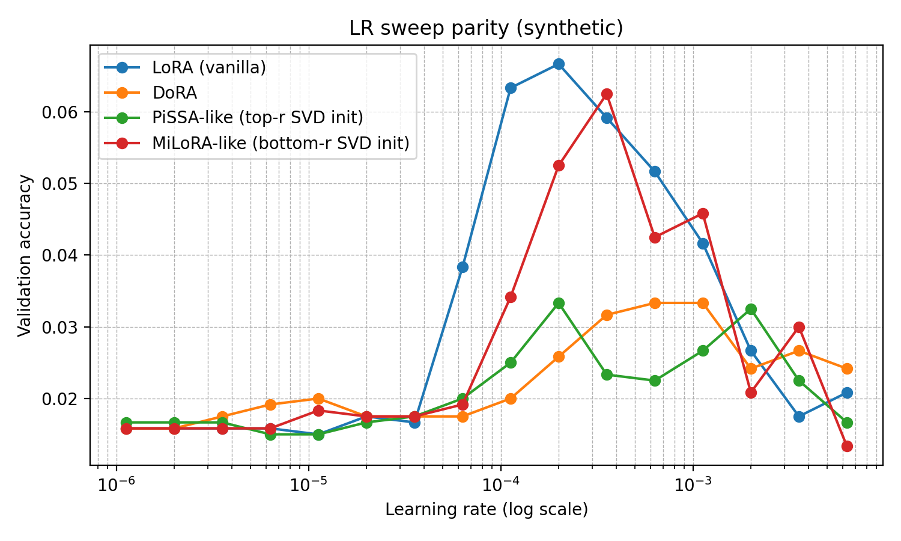
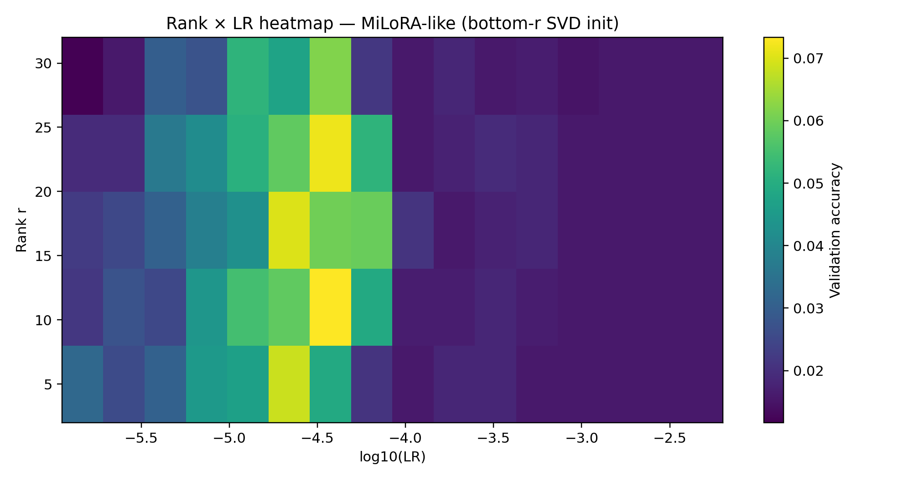
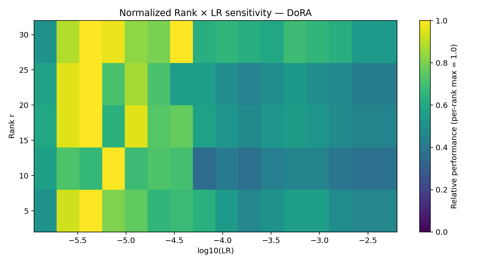
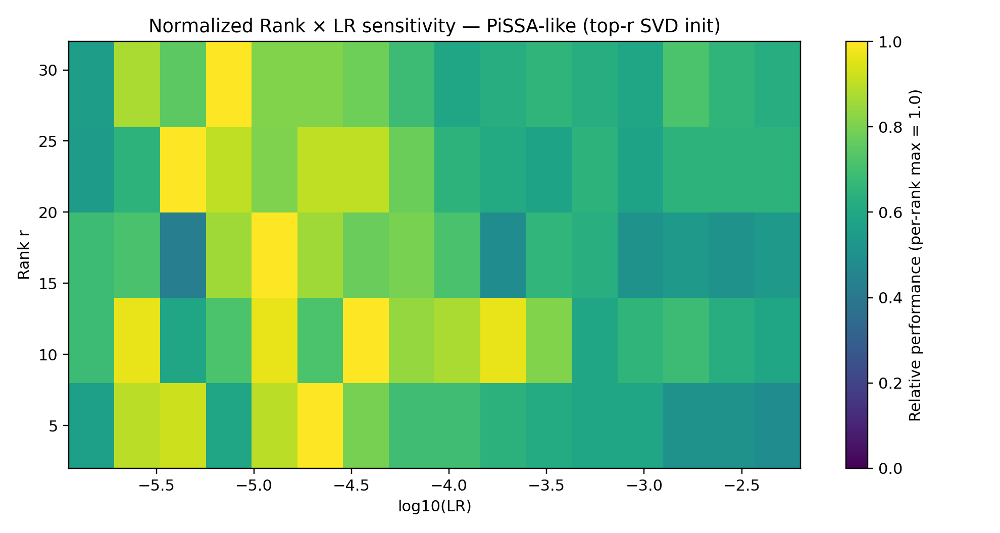
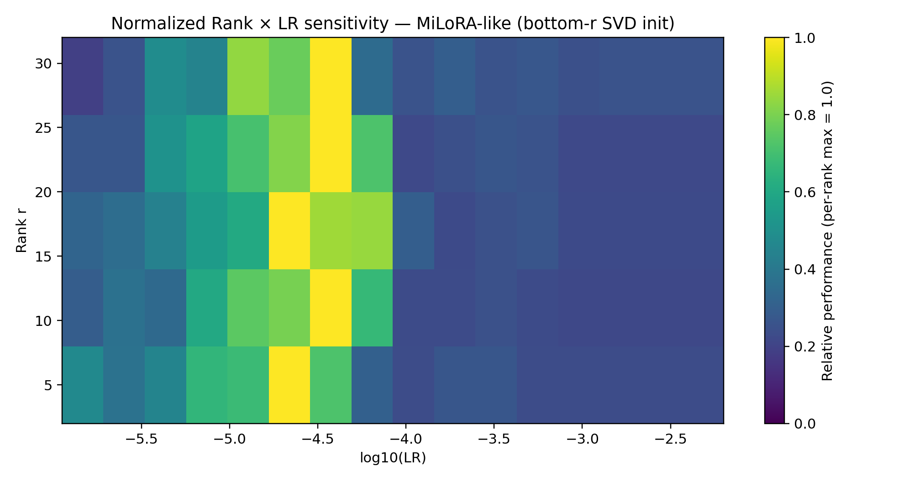

# Rank × Learning-Rate Sensitivity in LoRA-Style Adaptation  
*A controlled synthetic study inspired by MiLoRA*

---

## TL;DR

> **Once you normalize per-rank performance, LoRA, DoRA, PiSSA-like, and MiLoRA-like adapters exhibit remarkably similar learning-rate sensitivity.**  
>  
> Most apparent differences between methods come from *where their best LR happens to land*, not from fundamentally different optimization behavior.

This repository contains a **fully reproducible synthetic benchmark** that:
- Pretrains a small transformer on one task
- Finetunes it with **LoRA-style adapters**
- Sweeps **learning rate × rank**
- Visualizes **raw**, **best-of-LR**, and **per-rank normalized** performance

The experiments are inspired by **MiLoRA**  
📄 *MiLoRA: Efficient Fine-Tuning via Bottom-Rank Adaptation*  
👉 https://arxiv.org/abs/2602.04998

---

## Motivation

Recent low-rank adaptation methods — **LoRA**, **DoRA**, **PiSSA**, **MiLoRA** — are often compared by reporting a *single best result* at a *single learning rate*.

However:
- LR sensitivity is strong in low-rank regimes
- Different methods shift the *location* of the optimal LR
- Comparing unnormalized performance can conflate **LR tuning effects** with **method quality**

This repo answers a simpler question:

> **If we control for learning rate properly, do these methods actually behave differently?**

---

## Experimental Setup (Synthetic but Diagnostic)

- **Model**: small transformer classifier
- **Task**: synthetic “retrieve-at-k” rule (distribution shift between pretrain & finetune)
- **Adapters**:
  - LoRA (vanilla)
  - DoRA (magnitude–direction decoupling)
  - PiSSA-like (top-r SVD init)
  - MiLoRA-like (bottom-r SVD init)
- **Sweeps**:
  - Learning rate: `1e-6 → ~6e-3`
  - Rank: `{4, 8, 16, 32}`
- **Device**: CPU by default (CUDA/MPS optional)

---

## 1️⃣ Learning-Rate Sweep Parity (Single Rank)

Below: validation accuracy vs learning rate for **rank = 16**.



**Observations**
- All methods show a narrow “good LR band”
- MiLoRA-like and vanilla LoRA peak higher
- PiSSA-like is more conservative
- DoRA sits in between

But this plot alone hides rank effects.

---

## 2️⃣ Rank × Learning-Rate Heatmaps (Raw)

Each heatmap shows validation accuracy across `(rank, LR)`.

### LoRA (vanilla)


### DoRA


### PiSSA-like (top-r SVD init)


### MiLoRA-like (bottom-r SVD init)


**Raw takeaways**
- Optimal LR shifts with rank
- Higher rank does *not* monotonically help
- Each method appears to “prefer” a different LR zone

At this stage, it’s tempting to conclude:
> “MiLoRA is better” or “PiSSA is worse”

But that conclusion is incomplete.

---

## 3️⃣ Best-of-LR vs Rank

For each rank, we take the **best accuracy over LR**.


**What this shows**
- MiLoRA-like dominates at low–mid ranks
- Vanilla LoRA improves steadily with rank
- DoRA and PiSSA lag but remain competitive

Still — this does not answer **LR sensitivity**.

---

## 4️⃣ The “Killer” Figure: Per-Rank Normalized LR Sensitivity

Now we normalize **each rank independently**:

> **For each rank r, divide performance by the best LR at that rank.**

This removes *absolute* performance differences and leaves only:
> **How sensitive each method is to LR choice**

### LoRA (normalized)


### DoRA (normalized)


### PiSSA-like (normalized)


### MiLoRA-like (normalized)


---

## Key Result

Once normalized **per rank**:

✅ LR sensitivity patterns look **strikingly similar**  
✅ Optimal LR bands align across methods  
✅ Differences are mostly **horizontal shifts**, not shape changes  

> **The main advantage of MiLoRA is not reduced LR sensitivity — it is better peak alignment at useful ranks.**

This matches the intuition (and claims) in **MiLoRA (arXiv:2602.04998)**:
- Bottom-rank components capture useful structure early
- Optimization is *not* fundamentally easier — just better positioned

---

## How to Reproduce Everything

### Install
```bash
pip install -r requirements.txt
